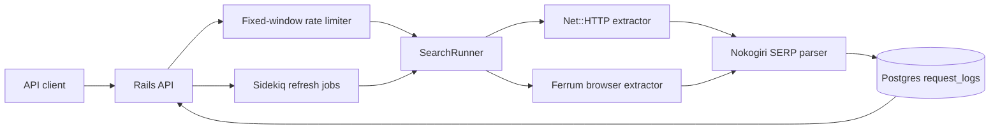

# SERP API Lab

A compact Ruby on Rails API that normalizes search-result pages into developer-friendly JSON. It is designed as a SearchApi-aligned portfolio project: Rails API conventions, parser tests, request logging, rate limiting, retries, Postgres persistence, and a browser-backed extractor path using Ferrum.

## Features

- `GET /search?q=python+jobs&engine=demo&page=1`
- Normalized JSON response with `organic_results`, metadata, pagination, and request timing.
- DuckDuckGo HTML extractor using `Net::HTTP` with retries and timeouts.
- Ferrum/Chromium browser extractor via `engine=browser_demo`.
- Parser object with RSpec coverage for SERP result normalization.
- Postgres-backed request logs for observability and product analytics.
- Sidekiq/Redis background job path for scheduled SERP refreshes.
- Fixed-window rate limiter for API protection.
- Rails API-only app, RSpec, RuboCop, Docker Compose, and GitHub Actions.

## Quick start

```bash
bundle install
docker compose up -d db redis
bundle exec rails db:prepare
bundle exec rails server
```

Then call:

```bash
curl "http://localhost:3000/search?q=python+jobs&engine=demo&page=1"
curl "http://localhost:3000/health"
```

## API response shape

```json
{
  "search_metadata": {
    "engine": "demo",
    "source": "duckduckgo_html",
    "fetched_at": "2026-07-08T00:00:00Z"
  },
  "search_parameters": {
    "q": "python jobs",
    "page": 1
  },
  "organic_results": [
    {
      "position": 1,
      "title": "Python Jobs",
      "link": "https://www.python.org/jobs/",
      "snippet": "Find Python jobs from the official Python job board.",
      "displayed_link": "www.python.org/jobs"
    }
  ],
  "pagination": {
    "result_count": 1,
    "has_more": true
  }
}
```

## Quality gates

```bash
bundle exec rspec
bundle exec rubocop
```

## Architecture



## Why this is useful for SearchApi-style roles

The project shows the important product muscles behind SERP APIs: normalized outputs, durable request logging, parser isolation, retryable extraction, browser fallback, API ergonomics, and tests around parser correctness.
